<a href="https://github.com/3899/SimAdminHub">
  
</a>

<div align="center">
  <br />
  <div>
    <a href="https://github.com/3899/">
      
    </a >
    <a href="https://github.com/3899/SimAdminHub/releases">
      
    </a >
    <a href="https://github.com/3899/SimAdminHub/releases">
      
    </a >
      <a href="https://github.com/3899/SimAdminHub/pkgs/container/simadminhub">
        
      </a>
  </div>
</div>

# SimAdminHub

SimAdminHub 是面向多台 [SimAdmin](https://github.com/3899/SimAdmin) 设备与宿主机直连蜂窝模组的 Web 集中管理中心。它集中保存和展示设备状态、短信、通知与自动化数据，并通过设备侧 SimAdmin Agent 或独立 Host Agent 下发操作。

SimAdmin 负责单台设备的独立运行与实际硬件控制；SimAdminHub 负责设备集合的统一管理。Hub 中所有业务数据按设备 ID 隔离，分组和标签只用于组织、筛选和规则范围，不引入项目、客户或租户模型。

当前后端使用 Rust、Axum 与 SQLite，前端使用 React、Vite 与 Material UI。正式发布提供 `x86_64`、`aarch64` Linux 安装包和多架构容器镜像。

> **使用前请先将所有子设备升级到最新版 SimAdmin。** SimAdminHub 依赖新版 SimAdmin 内置的 Hub Agent、接入接口和通信协议；旧版 SimAdmin 即使单设备后台工作正常，也无法完成 Hub 接入，常见表现是“请求的接口不存在”、自动发现后无法连接等。

## 核心功能

| 模块         | 核心能力                                                                                                                                                                      |
| ------------ | ----------------------------------------------------------------------------------------------------------------------------------------------------------------------------- |
| 总览         | 集中查看设备在线数量、Agent 连接、蜂窝可用性、运营商、网络制式、信号、温度、运行时长、接入方式和分层链路状态。                                                                |
| 设备管理     | 支持局域网发现、设备地址接入、设备端主动连接、自动或人工授权、分组、标签、编辑、删除解绑和身份冲突确认。                                                                      |
| 完整设备面板 | 网络设备直接渲染 SimAdmin 的状态、SIM、eSIM、蜂窝网络、设备网络、备份恢复、设备设置和设备本地 OTA 页面。                                                                      |
| 短信中心     | 首次接入全量同步设备历史短信，后续增量同步；支持按设备和会话查看、跨设备搜索、发送短信、会话选择和批量删除。                                                                  |
| 通知中心     | 集中配置 Webhook、Bark、PushPlus、企业微信、钉钉、飞书、Telegram、Email、Server酱等通道，以及转发规则、设备范围、日志和失败重试。                                             |
| 自动化中心   | 按全部设备、多个分组或指定设备执行重启基带、重启设备和发送短信任务，并记录每台设备的执行结果。                                                                                |
| Host Agent   | 在 Linux 宿主机管理不能安装 SimAdmin 的 USB/PCIe 蜂窝模组；添加设备时按需枚举`/dev/serial/by-id`、ModemManager、Direct AT、QMI、MBIM 和网络端点，关闭窗口后停止新设备扫描。 |
| 数据管理     | 提供组件存储统计、手动清理、自动保留策略、数据库整理、组件化备份、定时备份、预览和恢复。                                                                                      |
| 运行与发布   | 支持心跳和离线判定、Agent WebSocket 重连、命令账本、失败恢复、版本检查、systemd 安装和 Docker 部署。                                                                          |

当前版本为单管理员控制台，支持可选的管理员密码、会话有效期和空闲自动退出，不提供多用户、角色或租户。顶层集中 OTA 和日志中心尚未开放；SimAdmin 子设备完整面板仍保留设备本地 OTA。

## 文档

- [安装与部署](docs/public/install.md)：systemd、Docker、访问后台、设备接入、升级、灾备恢复、卸载和故障排查。
- [使用指南](docs/public/user-guide.md)：总览、设备、短信、通知、自动化、系统设置和状态说明。
- [安全部署](docs/public/security.md)：管理员密码、网络边界、反向代理、敏感数据和密钥保护要求。
- [版本记录](docs/public/changelog.md)：版本变化、当前限制和兼容性提示。

## 社区交流

群聊用于日常讨论、技术交流和经验分享。问题反馈与功能建议请提交 [Issues](https://github.com/3899/SimAdminHub/issues)。

<table>
  <thead>
    <tr>
      <th width="48%">QQ 群</th>
      <th width="48%">Telegram 群组</th>
    </tr>
  </thead>
  <tbody>
    <tr>
      <td>
        <picture>
          <source media="(prefers-color-scheme: dark)" srcset="./static/Community/QQGroup_Dark.png" />
          <source media="(prefers-color-scheme: light)" srcset="./static/Community/QQGroup_Light.png" />
          
        </picture>
      </td>
      <td>
        <picture>
          
        </picture>
      </td>
    </tr>
  </tbody>
</table>

## 快速安装

### systemd

支持带 systemd 的 `x86_64` 或 `aarch64` Linux 主机：

```bash
curl -fsSL https://raw.githubusercontent.com/3899/SimAdminHub/main/install.sh | sh
```

默认安装 Hub 与独立 Host Agent 服务，但 Host Agent 初始关闭且不会启动进程。需要管理本机直连模组时，再在“系统设置 > 概览”中启用。

国内网络可使用加速入口：

```bash
curl -fsSL https://gh-proxy.com/https://raw.githubusercontent.com/3899/SimAdminHub/main/install.sh | sh
```

安装脚本下载 Release 时会依次尝试 `gh-proxy.com`、`ghproxy.net`、`githubproxy.cc` 和 GitHub 官方地址。

### Docker

```bash
docker volume create simadminhub
docker run -d --name simadminhub --restart unless-stopped \
  --network host \
  --privileged \
  -v simadminhub:/app/data \
  -v /dev:/dev \
  -v /sys:/sys:ro \
  ghcr.io/3899/simadminhub:latest
```

镜像同时包含 Hub 和独立 Host Agent。Host Agent 默认不启动，需要管理 Docker 宿主机直连模组时可在“系统设置 > 概览”中一键启用。标准 Docker 安装使用 Linux host 网络，使容器可以接收局域网 mDNS 组播并自动发现设备；Hub 直接使用宿主机的 `3001` 端口。安全边界、Compose 和升级说明见[安装与部署](docs/public/install.md)。

安装后访问：

```text
http://HUB主机IP:3001
```

### 卸载

默认卸载程序并保留配置、数据库与备份：

```bash
curl -fsSL https://raw.githubusercontent.com/3899/SimAdminHub/main/uninstall.sh | sh
```

## 界面预览

> 以下界面截图中的设备与业务数据均为虚构信息。

#### 总览

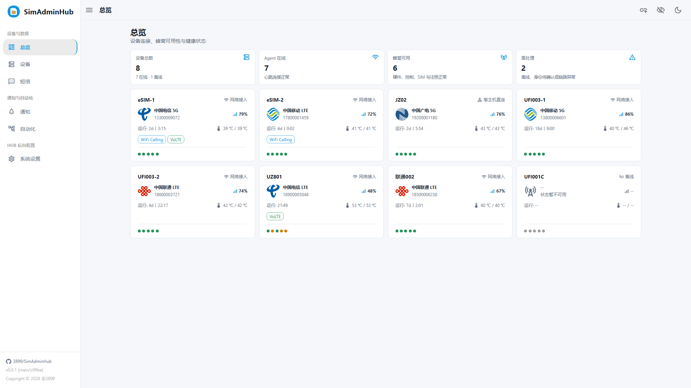

#### 设备详情面板

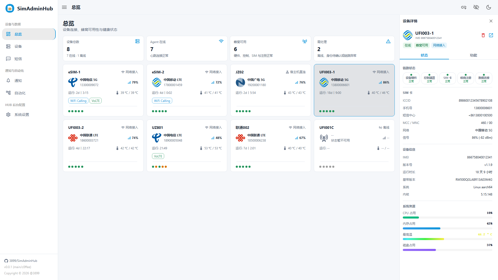

#### 设备管理

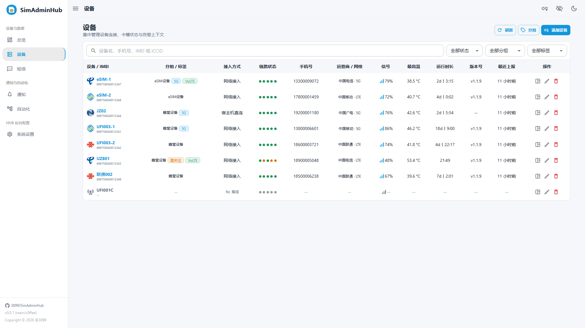

#### 完整设备面板

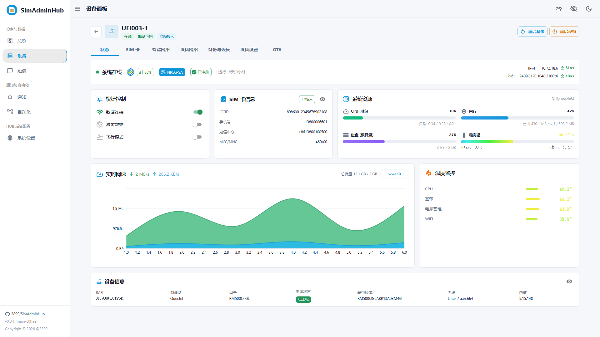

#### 短信中心

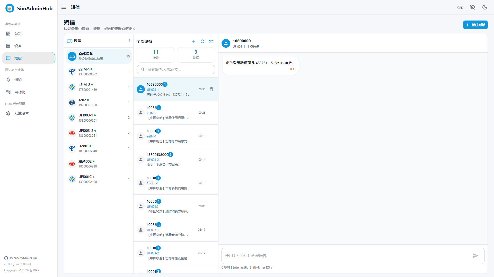

#### 通知 - 转发通道

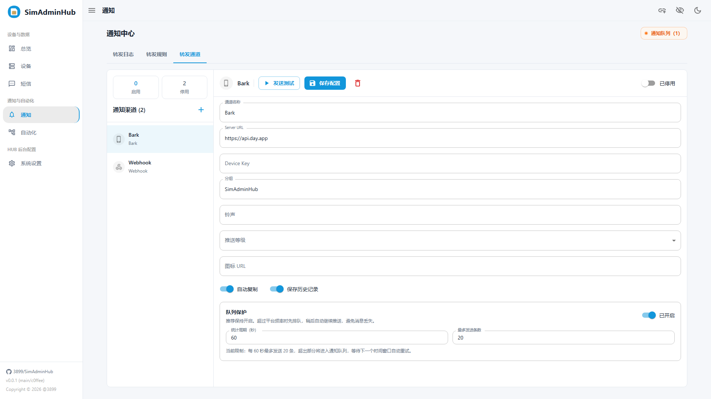

#### 通知 - 转发规则

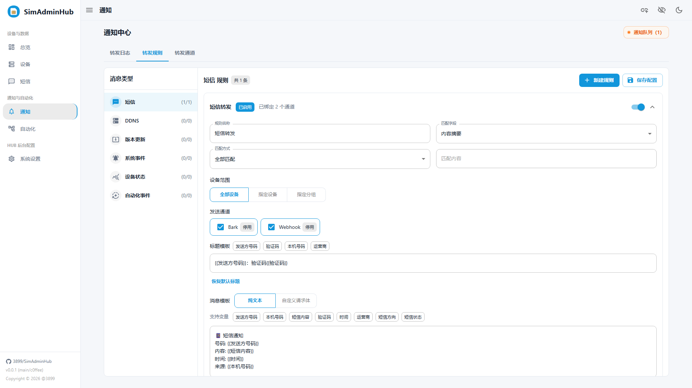

#### 通知 - 转发日志

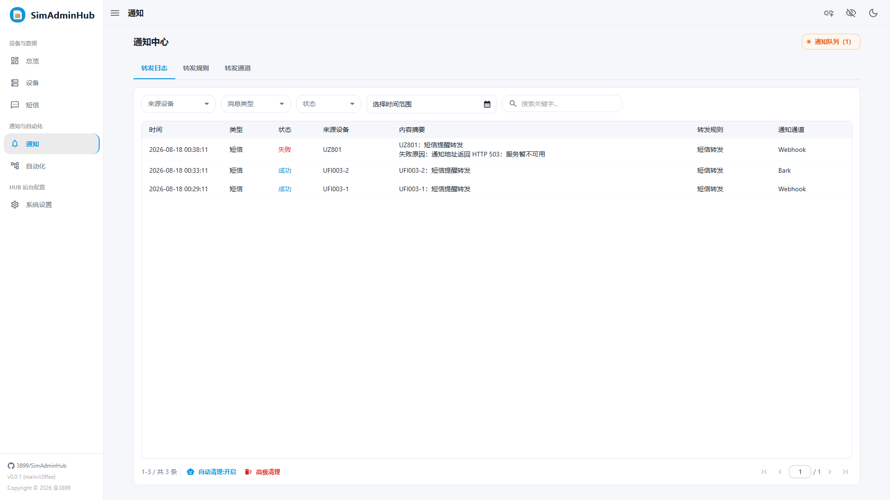

#### 自动化中心

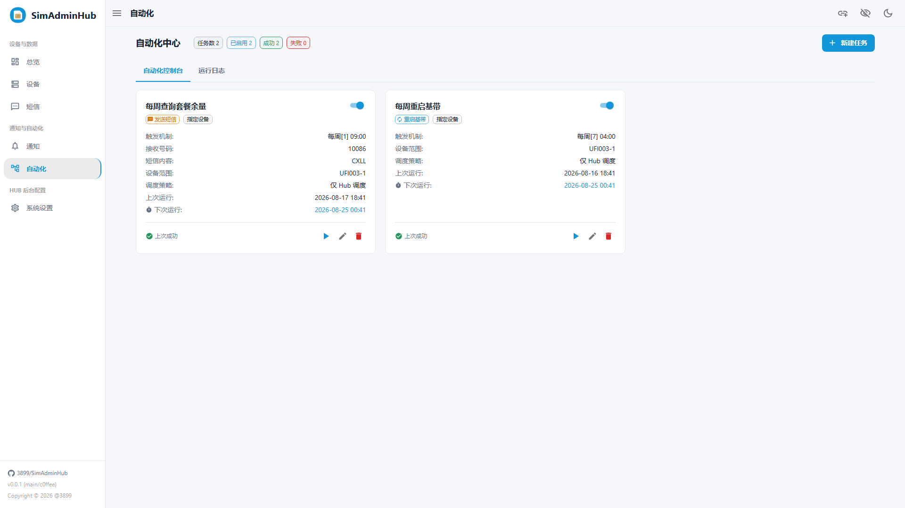

#### 自动化 - 运行日志

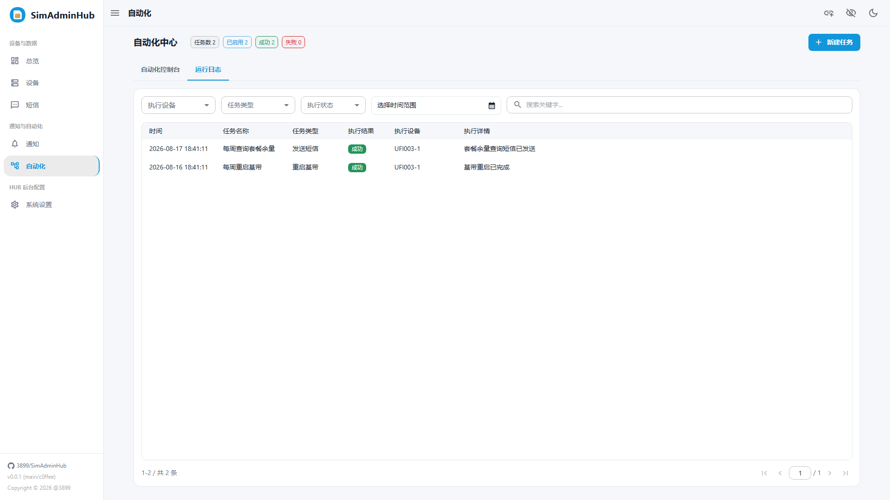

#### HUB 系统设置 - 概览

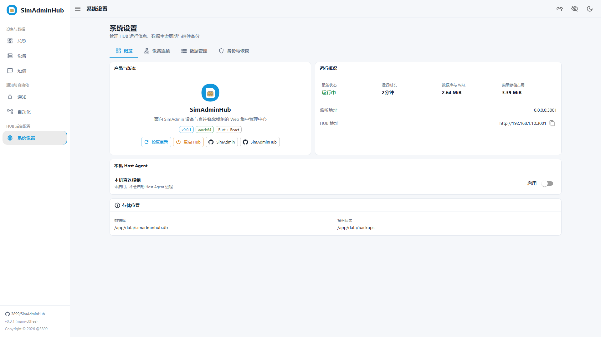

#### HUB 系统设置 - 设备连接

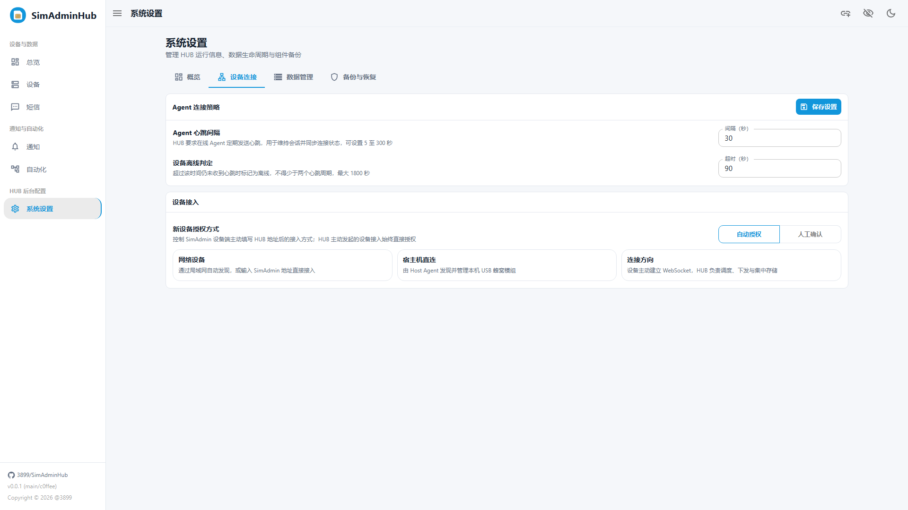

#### HUB 系统设置 - 数据管理

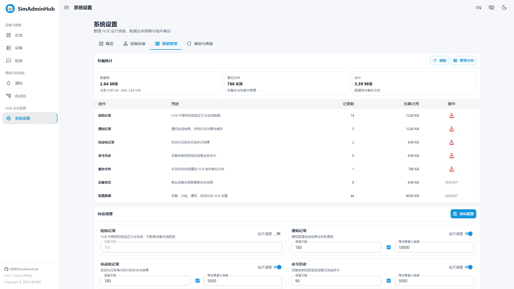

#### HUB 系统设置 - 备份与恢复

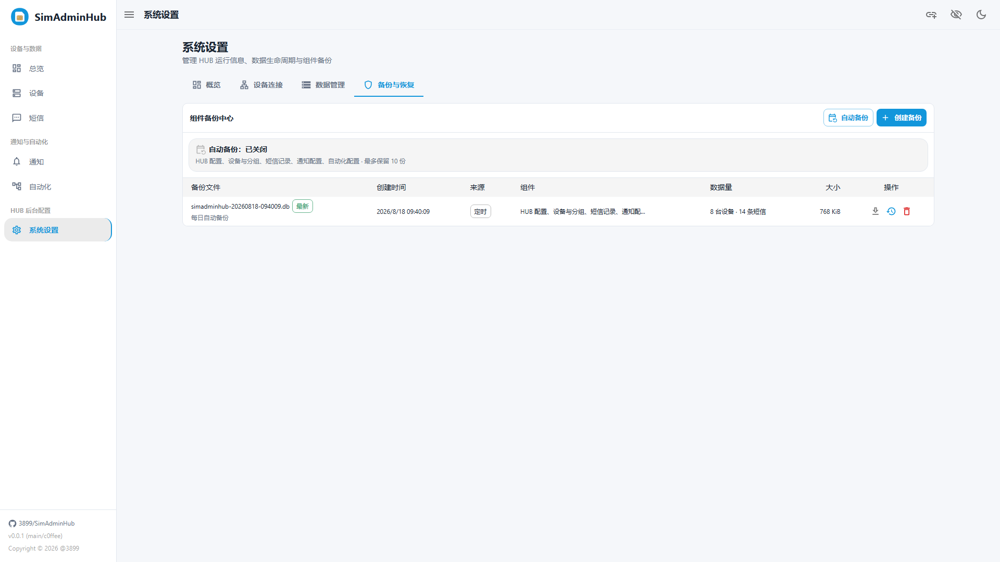

## 免责声明

SimAdminHub 会集中保存短信正文、手机号、ICCID、IMEI、通知通道密钥和设备运行状态，也可以发送短信、修改蜂窝设置、重启基带和重启设备。请仅管理你拥有控制权或已获得明确授权的设备。

管理员密码默认关闭以兼容已有安装，部署后应在“系统设置 > 安全”中设置密码并启用保护。不要将 Hub `3001` 端口直接暴露到公网；远程访问必须通过可信 VPN，或使用带 TLS 和来源限制的反向代理。顶部“隐藏敏感信息”只影响页面显示，不能代替访问控制或数据库加密。

不同模组、固件、内核、驱动、ModemManager、QMI、MBIM 和 AT 指令实现存在差异，界面显示某项能力不代表所有硬件都能成功执行。错误配置可能导致断网、蜂窝注册失败、短信计费、漫游费用、设备重启或需要人工恢复。

使用第三方 GitHub 下载加速服务意味着信任对应服务提供方；安全要求较高时应使用 GitHub 官方地址并自行核验网络与产物来源。使用者应在操作前备份数据并自行承担部署、配置和设备控制产生的风险。
